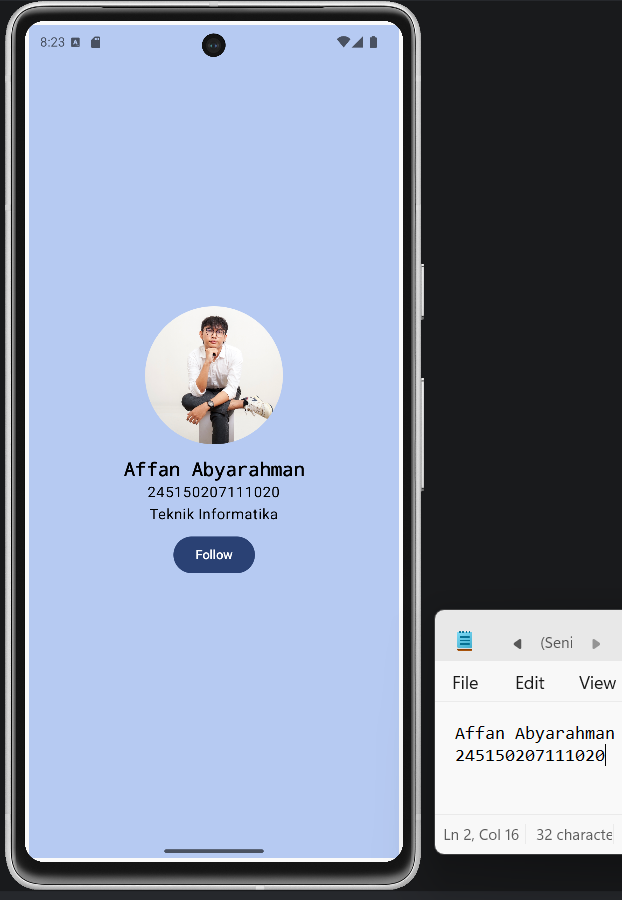
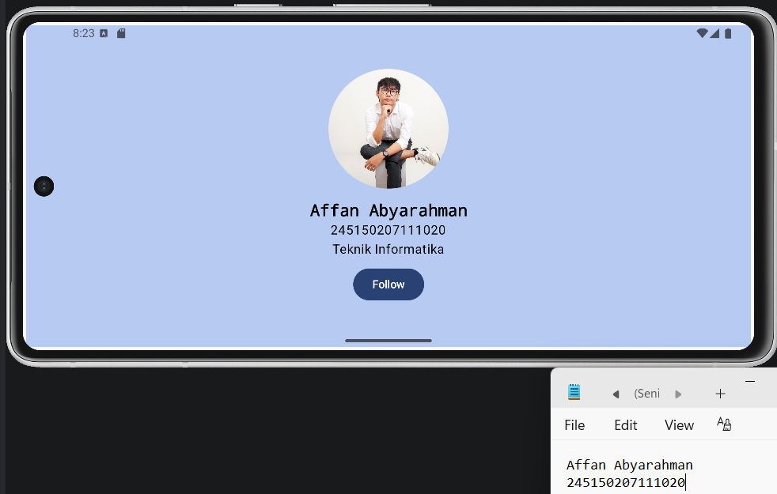

# Praktikum 2 PAPB

**Nama:** Affan Abyarahman  
**NIM:** 245150207111020  

## Screenshot

### Portrait

### Landscape

## Penjelasan Kode

Pada MainActivity, fungsi setContent digunakan untuk menampilkan ProfileScreen sebagai tampilan utama aplikasi. Di dalam ProfileScreen, seluruh komponen disusun menggunakan column. Alignment.CenterHorizontally digunakan agar isi berada di tengah secara horizontal, sedangkan Arrangement.Center membuat isi berada di tengah secara vertikal. fillMaxSize() membuat area layout memenuhi layar, kemudian padding() memberi jarak dari tepi dan background() digunakan untuk memberi warna pada background.

Foto profil ditampilkan menggunakan komponen Image dengan mengambil gambar dari folder drawable melalui painterResource. Ukuran foto diatur menggunakan Modifier.size dengan ukuran 150 dp dan clip(CircleShape) digunakan agar foto berbentuk lingkaran. Spacer digunakan untuk memberi jarak antara foto, teks, dan button supaya tampilannya tidak terlalu rapat.

Informasi profil ditampilkan menggunakan komponen Text, yaitu nama, NIM, dan program studi. Pada teks nama digunakan fontSize, FontWeight.Bold, dan FontFamily.Monospace untuk membedakannya dari informasi lain. Warna background dibuat menggunakan Color.hsv() dengan mengatur value hue, saturation, dan value.

Button Follow dan Unfollow dibuat pada fungsi FollowButton(). Value isFollowed disimpan menggunakan remember { mutableStateOf(false) }. Saat button ditekan, value tersebut dibalik dengan isFollowed = !isFollowed. Jika valuenya false, button menampilkan tulisan Follow, sedangkan jika valuenya true, tulisan berubah menjadi Unfollow.

Dibandingkan layout XML, Jetpack Compose terasa lebih ringkas karena tampilan dapat ditulis langsung menggunakan Kotlin. Perubahan tampilan juga lebih mudah diatur dengan state, seperti pada button Follow dan Unfollow yang otomatis berubah ketika value isFollowed berubah.
